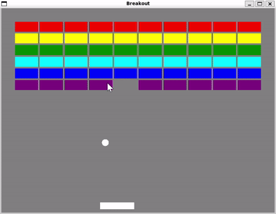

# rin

`rin` は Modern C++ (C++26) で書かれた、2Dゲーム開発向けの軽量なゲームエンジンです。




## 特徴

- **C++23 対応**: `std::expected` や などを活用した例外機構を使わないモダンなエラーハンドリング.
- **品質**: `nodiscard`や`explicit`、`noexcept`などを適切に付与. 
- **2D レンダリング機能**: 頂点バッファ描画、スプライト、テキスト表示、カメラ制御.

## 動作環境

- **C++ コンパイラ**: C++26 サポート(内部でC++26で追加されたライブラリ機能を使用します)
- **CMake**: 3.30 以上
- **WSL2**: 推奨環境（必要なOpenGLやGPU等の依存関係が`.devcontainer/`にセットアップ済み）

本ライブラリで実際のコンシューマー向けゲーム開発を行う点については**注意が必要**です。
C++26の一部機能は2026/10/3現在、ClangやMSVC等のコンパイラで安全に動作しない可能性があり、Windows環境でのコンパイルが不安定となっています。
このプロジェクトの目的自体が開発者本人のグラフィックスプログラミング学習という点も側面として存在し、本格的なゲーム開発を考慮していないため、本ライブラリはWindows環境で実行可能なプログラムファイルの生成を行う設定を行っていません。
Linux/WSL環境で動作するゲームの開発のみが事実上可能です。


## 導入方法

自身の `CMakeLists.txt` に以下を追加してください。

```cmake
include(FetchContent)

FetchContent_Declare(
    rin
    GIT_REPOSITORY https://github.com/yahagikimuthi/rin.git
    GIT_TAG        v1.0.0
)
FetchContent_MakeAvailable(rin)

# 自身のターゲットにリンク
target_link_libraries(MyProject PRIVATE rin::rin_lib)
```

ソースコードでは以下のようにincludeします。
```cpp
#include <rin/rin.hpp>

auto main() -> int {
    // 使用方法はexamplesを参照
}
```


## サンプルコード (Examples)

リポジトリ内の `examples/` ディレクトリに、上記のブロック崩しをはじめとするサンプルコードを公開しています。


## 使用するサードパーティライブラリ

このゲームエンジンは以下のサードパーティライブラリを使用します。

- **glm**: 行列演算ライブラリ. `rin::vec2`などは`glm::vec2`との変換関数を用意.
- **glad, KHR, GLFW**: グラフィックAPIです.
- **miniaudio**: 音源を利用するため`audio_engine`クラスなどが使用します.
- **stb**: テクスチャ及びそれに基づくスプライト,フォント,文字列の利用のため使用します.